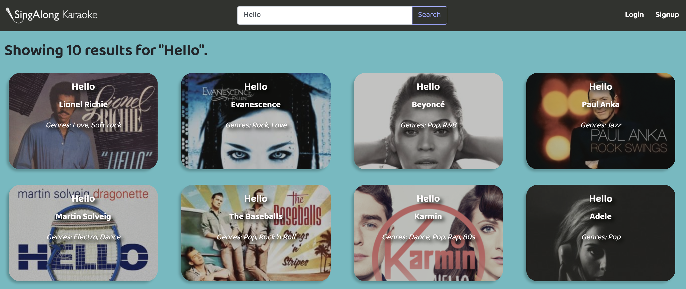

# SingAlong Karaoke


## Overview

This project is a React-based application that utilizes MySQL, Express, and Node.js to allow users to search and save their favorite karaoke songs.

This app allows users to:
* Search for popular karaoke songs 
* View details about the songs including: 
    * Lyrics
    * Youtube karaoke video
    * Other songs by the same artist
    * etc. 
* Sign up for an account which allows users to save songs for future reference


Link to project: https://shrouded-cliffs-43407.herokuapp.com/




## Technologies Used 

* Front-end
    * ReactJS
    * Javascript
    * Sass
    * Bootstrap

* Back-end
    * Node JS
    * Express
    * MySQL (Sequelize)

* Third-party APIs
    * Genius API
    * Youtube API
    * Musixmatch API


## Getting Started

1. Run git clone on the repository and open the project in your local directory.

2. In your local directory, run a npm install in the root directory (for back-end dependencies) and the client folder (for front-end dependencies).

    The following packages will be installed:

    * Back-end

        * axios

        * sequelize

        * mysql2

        * express

        * express-session

        * passport

        * passport-local

        * bcryptjs

        * compression

        * cookie-session

        * genius-api

        * if-env

        * dotenv

    * Front-end

        * axios

        * bootstrap

        * node-sass

        * react

        * react-bootstrap

        * react-dom

        * react-router-dom

        * react-scripts

3. Copy the code in db/schema.sql and paste in MySQL Workbench and run in order to create the "karaoke_db" database.

4. Change the config.json in the config folder to include your MySQL local host password in the development section:

```
"development": {
    "username": "root",
    "password": [INSERT PASSWORD HERE],
    "database": "karaoke_db",
    "host": "127.0.0.1",
    "dialect": "mysql"
  }

  ```

5. Run node server on the root directory. This will create the tables in MySQL workbench based on the Sequelize models.

6. Import the .csv file in the db folder into the "Songs" table in the "karaoke_db" database in MySQL workbench. This will seed the song database.

7. Run npm start in your root directory to launch the app on localhost:3000.

## Attribution

* "Songs" table in the "karaoke_db" database is populated by the <a href="https://www.karafun.com/karaoke-song-list.html" target="_blank">Karafun karaoke catalog</a>.

* Duet icons adapted from  <a href="https://www.flaticon.com/authors/freepik" title="Freepik">Freepik</a> from <a href="https://www.flaticon.com/" title="Flaticon"> www.flaticon.com</a>

## Link to Project

View project here: https://shrouded-cliffs-43407.herokuapp.com/